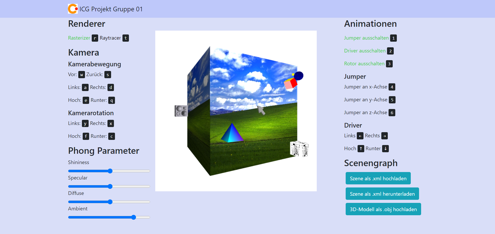

# ICG Projekt von Gruppe 01
<!-- Ein Bild der Anwendung muss im Ordner ./img relativ zu dieser Datei liegen -->



Dieses Repository beinhaltet das Projekt des Kurses  "Interaktive Computergraphik" von Melina Heinisch, Bao Han Dam und Martin Böhm

# Projekt Struktur
<!-- Ihr könnt die Projektstruktur beliebig beschreiben. Hier einfach mit dem Unix Programm `tree`  -->

```
.
├── dist
│   ├── objs <-- .obj Files
│   ├── textures <-- Texturen
│   ├── index.html
│   ├── abgabe.xml <-- Initialer Scenengraph
│   └── scenegraph.xml <-- Zweiter Scenengraph zum Testen
├── src
│   ├── math_library
│   │   ├── intersection.ts
│   │   ├── matrix.ts
│   │   ├── ray.ts
│   │   ├── transformation.ts
│   │   └── vector.ts
│   ├── nodes
│   │   ├── animation-nodes.ts
│   │   └── nodes.ts
│   ├── raster_geometry
│   │   ├── raster-box.ts
│   │   ├── raster-obj.ts
│   │   ├── raster-pyramid.ts
│   │   ├── raster-sphere.ts
│   │   └── raster-texture-box.ts
│   ├── ray_geometry
│   │   └── sphere.ts
│   ├── shading
│   │   ├── phong.ts <- Phong Shader für Raytracer
│   │   ├── phong-fragment-shader.glsl
│   │   ├── phong-vertex-perspective-shader.glsl
│   │   ├── shader.ts
│   │   ├── texture-phong-fragment-shader.glsl
│   │   └── texture-vertext-perspective-shader.glsl
│   ├── visitors
│   │   ├── clickObjectVisitor.ts
│   │   ├── lightAndCameraVisitor.ts
│   │   ├── rastervisitor.ts
│   │   ├── rayvisitor.ts
│   │   └── visitor.ts
│   ├── xmlParser
│   │   ├── scenegraphToXmlVisitor.ts
│   │   └── xmlToScenegraph.ts
│   ├── glsl.d.ts
│   ├── index.ts
│   └── project-boilerplate.ts <- Projekt
├── .gitignore
├── README.md
├── package-lock.json
├── package.json
├── tsconfig.json
└── webpack.config.json

```

Das Projekt ist in mehreren Ordner thematisch aufgeteilt. 
`dist` beinhaltet Ressourcen die im Browser direkt verwendet werden. In `objs` liegen Beispieldateien, welche durch unseren OBJ Loader in die Szene geladen werden können, in `textures` Texturen die von der Texture Box verwendet werden. 
Unter `src` sind alle Quelldateien zusammengefasst, welche durch `webgl` transpiliert werden.
Hierbei haben wir die Pakete entsprechend ihren Funktionen strukturiert:
- `math-library`  umfasst jegliche mathematische Berechnungen die benötigt werden, so z.B. Matrizen
- `nodes` umfasst jegliche Arten von Knoten für den Szenengraphen. Darunter fallen sowohl Gruppen-Knoten uns Objekte, als auch Animationskonten, Lichter und Kamera.
- `raster_geometry` enthält alle Objekte, die der Rasterizer rendern kann, so z.B. Würfel oder Pyramiden.
- `ray_geometry` umfasst alle Objekte, die der Raytracer rendern kann. In unserem Fall ist das lediglich die Kugel.
- `shading` enthält jegliche Files die für das Shading von Objekten verwendet werden. Hierbei sind die .glsl Files für den Rasterizer und das phong.ts File für den Raytracer
- `visitors` verfügt über verschienene Visitor, die den Szenengraphen traversieren. Hierbei wird zwischen Rasterizer und Raytracer unterschieden, außerdem gibt es eine Visitor um Licht und Kameraknoten vor dem Rendervorgang aus dem Szenengraphen auszulesen, dieser Vorgang ist für Rasterizer und Raytracer identisch.
- `xmlParser` umfasst zwei Files, die das hoch- und herunterladen von .xml Files übernehmen. 

# Installation

Wechseln Sie mit einer Konsole in das Verzeichnis dieser Datei und füren Sie 

```
npm install
```
aus.
### Ausführung
Geben Sie anschließend 
```bash
npm start
```
eingeben und rufen die Website des Servers über to `0.0.0.0:8080` bzw. `localhost:8080` im Browser aufrufen. Der Port ist hierbei aus der Ausgabe der Konsole zu ersetzen. Im Normalfall sollte sich automatisch ein Tab mit der richtige Adresse in Ihrem Standardbrowser öffnen.


# How-To

Im folgenden wird erklärt wie die Anwendung zu bedienen ist:

## Größe der Canvas ändern
Sollte zu Testzwecken die Canvas Größe verändert werden, muss diese zum einen im HTML File `dist/index.html` geändert werden.
Außerdem muss in der `visitors/lightAndCameraVisitor.ts` in der Methode `visitCameraNode jeweils für beide Kameras die Größe der Canvas angegeben werden.

## Wechseln der Renderer
Mit Drücken von `r` auf der Tastatur wird der Rasterisierer verwendet.

Mit Drücken von `t` auf der Tastatur wird der Raytracer verwendet.

## Objekt per Maus auswählen
Hierfür einfach das Objekt der Wahl anklicken. Zum Abwählen muss einmal auf eine freie Stelle der Canvas geklickt werden.

## Animationen
### Animationen stoppen
Mit Drücken von `4` auf der Tastatur wird der Jumper deaktiviert.

Mit Drücken von `5` auf der Tastatur wird der Driver deaktiviert.

Mit Drücken von `6` auf der Tastatur wird der Rotor deaktiviert.

### Jumper steuern
Mit Drücken von `1` auf der Tastatur hüpft der Jumper an der x-Achse entlang.

Mit Drücken von `2` auf der Tastatur hüpft der Jumper an der y-Achse entlang.

Mit Drücken von `3` auf der Tastatur hüpft der Jumper an der z-Achse entlang.

### Driver steuern
Mit Drücken von `Pfeiltaste hoch` auf der Tastatur fährt der Driver hoch, also in positive y-Richtung.

Mit Drücken von `Pfeiltaste herunter` auf der Tastatur fährt der Driver herunter, also in negative y-Richtung.

Mit Drücken von `Pfeiltaste rechts` auf der Tastatur fährt der Driver rechts, also in positive x-Richtung.

Mit Drücken von `Pfeiltaste rechts` auf der Tastatur fährt der Driver links, also in negative x-Richtung.


## Free Flight Modus

Mit Drücken von `w` bewegt sich die Kamera nach vorne, mit `s` nach hinten.

Mit Drücken von `a` bewegt sich die Kamera nach links, mit `d` nach rechts.

Mit Drücken von `e` bewegt sich die Kamera nach oben, mit `q` nach unten.

Mit Drücken von `x` rotiert die Kamera nach rechts, mit `y` nach links.

Mit Drücken von `f` rotiert die Kamera nach oben, mit `c` nach unten.


## Beleuchtungsparameter

Auf der Seite befinden sich vier beschriftete Slider, mit denen man die entsprechenden Phong Parameter 'Shininess', 'Ambient', 'Diffuse' und 'Specular' verändern kann. Die Änderungen werden direkt in der Szene sichtbar.

## Funktionen

| Nummer  | Punkte | Beschreibung  | bearbeitet | Verantwortliche/r |
| ------------- | ------------- | ------------- | ------------- | ------------- |
| M1  |6  |Szenengraph | <ul><li>[X] </li></ul> |Melina Heinisch, Bao Han Dam |
| M2  |14 |Rasteriser & Ray Tracer | <ul><li>[X] </li></ul> |Melina Heinisch, Bao Han Dam|
| M3  |5  |min. drei eingebundene Objekte | <ul><li>[X] </li></ul> |Melina Heinisch, Bao Han Dam |
| M4  |7  |min. drei verschiedene Animationsknoten| <ul><li>[X] </li></ul> |Melina Heinisch |
| M5  |4  |mehrfarbige Objekte | <ul><li> [X] </li></ul> |Melina Heinisch |
| M6  |7  |mathematische Bibliothek |<ul><li> [X] </li></ul> |Melina Heinisch, Bao Han Dam|
| M7  |7  |Phong Shader | <ul><li> [X] </li></ul> |Melina Heinisch, Bao Han Dam |
| O1  |6  |mehrere Texturen | <ul><li> [X] </li></ul> |Melina Heinisch |
| O2  |10 |Auswahl und Manipulation von Objekten | <ul><li> [X] </li></ul> |Melina Heinisch|
| O3  |6 |Laden und Speichern | <ul><li> [X] </li></ul> |Melina Heinisch |
| O4  |6 |Model Loader | <ul><li> [X] </li></ul> |Bao Han Dam |
| O5  |8 |Kamera Knoten | <ul><li> [X] </li></ul> |Melina Heinisch |
| O6  |8 |mehrere Lichtquellen |<ul><li> [X] </li></ul> |Melina Heinisch |
| O7  |6 |Free Flight Modus | <ul><li> [X] </li></ul> |Melina Heinisch |

## Kompatibilität
Das Projekt wurde mit folgenden Konfigurationen getestet:
<!-- Nur die Konfigurationen angeben die ihr wirklich getestet habt. Eine gängige Kombination ist hier schon ausreichend-->
- Windows 10 Version 21H1, Build 19043.1165 mit
  - Firefox Version 91.0.2
  - Chrome Version 93.0.4577.63 
  - Edge Version - nein
  - Internet Explorer - nein 
  - node js Version v14.16.1. und  v14.17.0.
